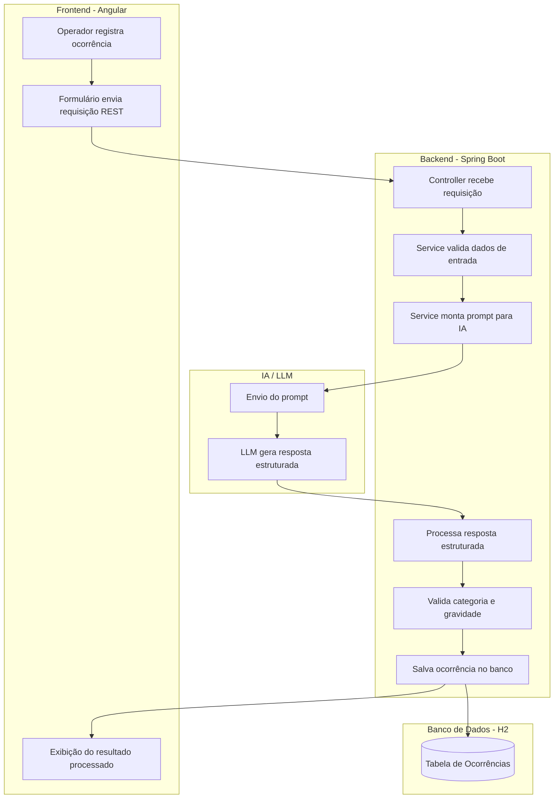
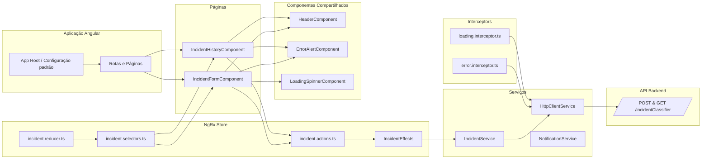
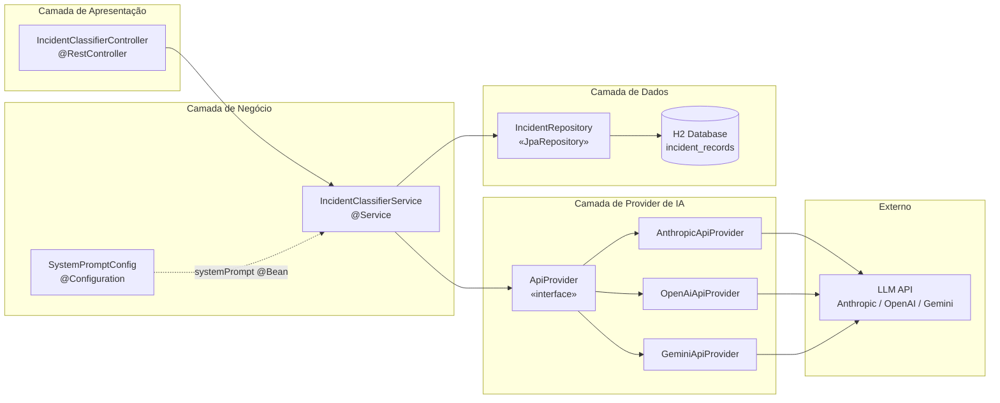
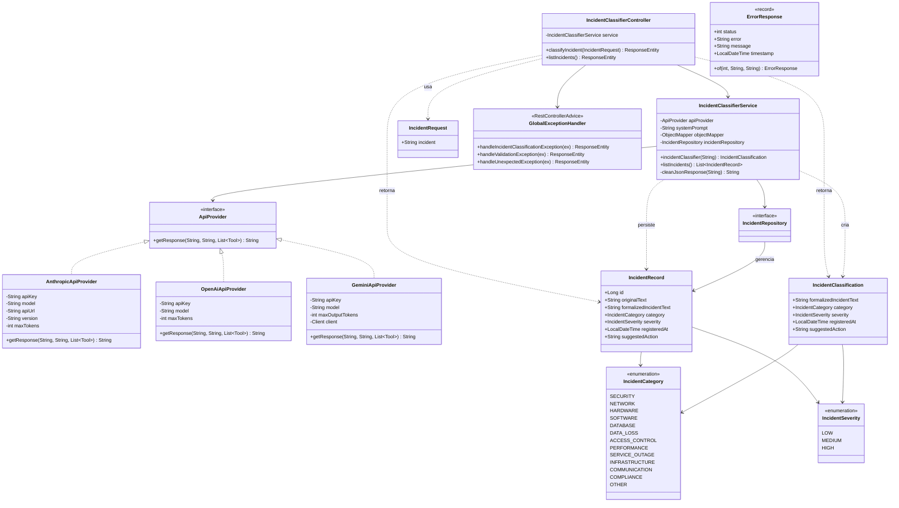
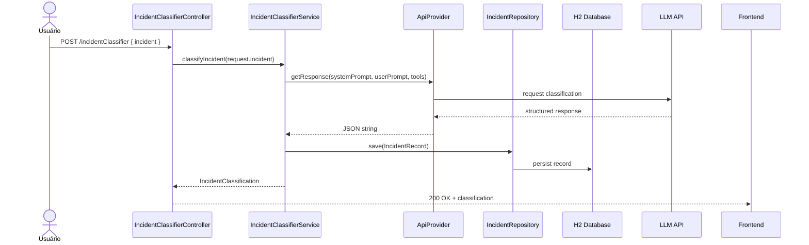
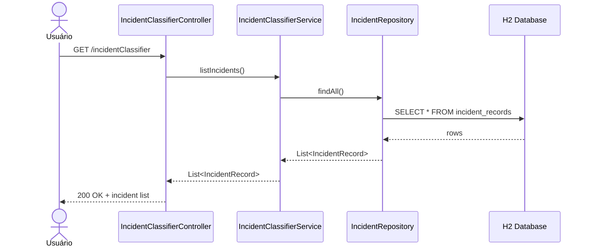

# Sistema Inteligente de Classificação de Ocorrências — Diagrama UML (SICO)

---

## 1. Arquitetura Resumida

### 1.1. Backend

```
Controller → Service → ApiProvider (interface)
                ↓              ↓
          Repository    [OpenAI | Gemini | Anthropic]
                ↓
           H2 Database
```

- **Controller**: recebe e valida a requisição REST
- **Service**: orquestra a chamada à IA e a persistência
- **ApiProvider**: interface que abstrai o provider de LLM
- **Repository**: acesso ao banco via Spring Data JPA

### 1.2. Frontend

```
Pages → NgRx Store → Effects → Services → Backend API
                ↓
          Components (UI)
```

- **Pages**: telas de registro e histórico
- **NgRx Store**: estado global da aplicação
- **Services**: chamadas HTTP ao backend
- **Components**: badges, spinner, alertas

### 1.3. Fluxograma do sistema



---

## 2. Diagramas

### 2.1. Frontend

#### 2.1.1. Visão em camadas da estrutura



---

### 2.2. Backend

#### 2.2.1. Visão em camadas da estrutura



---

#### 2.2.2. Diagrama de classes

Estrutura das classes, atributos, métodos e relacionamentos.



---

#### 2.2.3. Diagrama de Sequência — Fluxo Principal (POST)

Fluxo completo de registro e classificação de uma ocorrência.



---

#### 2.2.4. Diagrama de Sequência — Listagem do Histórico (GET)

Fluxo de consulta ao histórico de ocorrências.


